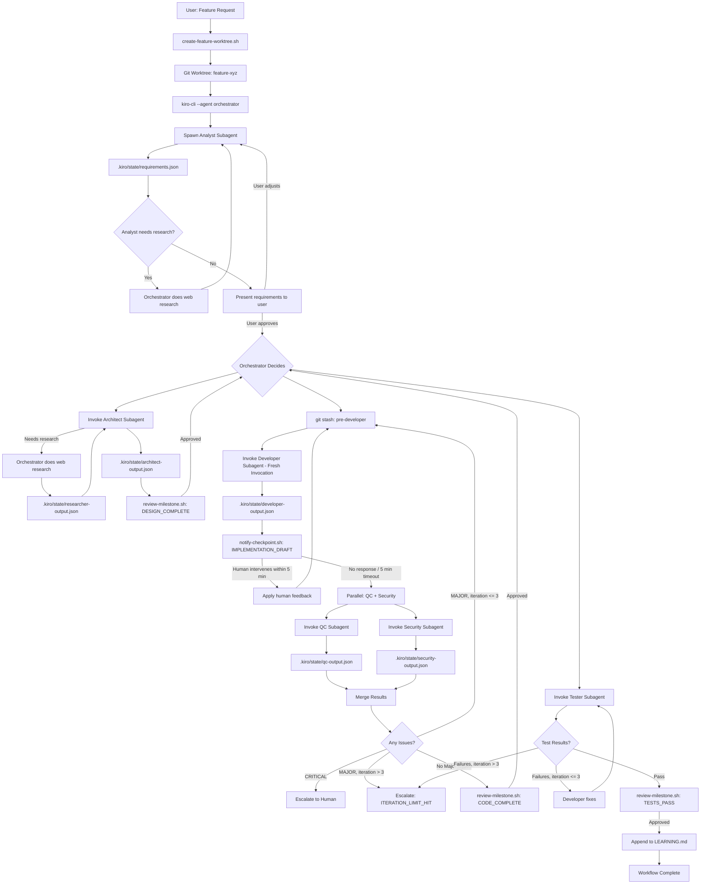

# Implementation Plan - Multi-Agent Java Feature Orchestrator

## Problem Statement

Build a multi-agent orchestration system that coordinates specialized AI agents to collaboratively add features to your Java application. The system uses git worktrees for isolation, Kiro CLI's native custom agent capabilities for LLM interactions, and a dynamic workflow where an Orchestrator agent coordinates specialized agents (Software Architect, Senior Java Developer, QC, Security Architect, Tester, Researcher).

## Requirements

### Agent Architecture
- LLM-based agents using Kiro CLI's native custom agent system
- Orchestrator agent invokes other agents as subagents within Kiro session via the 'use_subagent' tool
- Each agent has specialized system prompts, tools, and resources

### Workflow
- Dynamic workflow: Orchestrator decides which agents to invoke based on task requirements
- Bounded iterative feedback loops: Developer e QC and Developer e Security (max 3 iterations each escalate to human if cap hit)
- Bounded test-fix loop: Tester . Developer (max 3 iterations, escalate to human if cap hit)
- Three-tier issue severity: MINOR (log and continue), MAJOR (loop to developer), CRITICAL (stop and escalate to human immediately)
- Parallel execution: OC and Security run in parallel after developer pass (independent reviews) results merged before developer feedback
- Single git worktree per feature for all agents to work sequentially (except QC/Security parallel phase)
- Human review at milestones: after architecture design, after code complete, after tests pass
- Non-blocking checkpoint after first developer pass (IMPLEMENTATION_DRAFT): human has 5 min to intervene, auto-proceeds if no response
- Async abort/pause signaling: human can signal workflow at any time via signal-workflow.sh

### Integration
- Leverage Kiro CLI's native agent configuration system (`.kiro/agents/`)
- Modifies your codebase externally via git worktree
- Targeted analysis of relevant modules only

## State Management
- Shared file system for agent state and communication (`.kiro/state/`)
- Git worktree provides isolation from main development
- Agent outputs stored in structured JSON files

### Model Selection
- Each agent specifies its model via the `model` field (must match `/model` command output)
- Orchestrator, Architect, Developer, Security: claude-sonnet-4.5' (complex reasoning, code generation)
- Analyst, QC, Tester: *claude-haiku-4.5' (pattern matching, structured analysis)
- **Note**: Verify exact model IDs with '/model' command before deployment.

### Context Management
- **`contextManagement` is NOT a valid Kiro agent config field** - compaction logic must be handled entirely in the orchestrator prompt
- Orchestrator tracks cumulative iteration counts per agent in 'workflow-state. json'
- Orchestrator instructs long-running agents to use '/compact' command based on iteration thresholds defined in the prompt
- State files serve as persistent memory across compactions
- Fresh invocation model: each agent loop iteration is a new subagent invocation (clean context) relying on state files for continuity

### External KnowLedge (Researcher Agent)
- Dedicated Researcher subagent for web search when internal knowledge insufficient
- **CRITICAL CONSTRAINT**: `web_search` and `web_fetch` are NOT available in subagent runtime (see Subagent Tool Limitations below)
- **Workaround**: Researcher must run as a direct agent invocation (not subagent), OR the orchestrator itself performs web research using its own tools, OR research is done as a pre-workflow step
- Triggered by Orchestrator in three scenarios:
  1. **Proactive (before architect)**: Read `requirements.json` (analyst output). 2-3 targeted web searches for design patterns, framework best practices, and known issues specific to the technologies/versions identified by the analyst.
  2. **Proactive (before security)**: Read `developer-output.json` + `architect-output.json`. 2-3 targeted web searches for CVEs, OWASP guidance, and security advisories specific to dependencies added and patterns implemented
  3. **Reactive**: When any subagent sets `researchNeeded: true` - orchestrator researches and re-invokes (max 1 round per subagent)
- Researcher returns curated findings to requesting agent via state file
- Prevents agents from hallucinating solutions or repeating failed approaches

### User Interaction
- Natural Language feature description as input
- Orchestrator spawns analyst subagent for requirements, then presents results to user for approval/ refinement
- ALL user interaction mediated through the orchestrator (subagents are non-interactive)
- Milestone-based approval gates (blocking): DESIGN_COMPLETE, CODE_COMPLETE, TESTS_PASS
- Non-blocking checkpoint: IMPLEMENTATION_DRAFT (auto-proceeds after 5 min timeout)
- Forced escalation points: ITERATION_LIMIT_HIT, CRITICAL issue detected, budget exhausted
- Async workflow signaling: human can pause/abort at any time via 'signal-workflow.sh'

### Deliverables
- Code changes in worktree ready for commit
- No automatic documentation or PR generation

### Rollback & Recovery
- Git stash checkpoints before each agent pass (e.g., `pre-developer-v1`, `pre-qc-v1`)
- On abort: preserve worktree with stashed checkpoints for manual review
- Orchestrator creates stash before invoking each agent; on abort, human can `git stash list` and recover

### Agent Output Validation
- Orchestrator validates JSON schema of agent outputs before downstream consumption
- Malformed output triggers retry (once) then human escalation
- Prevents cascading failures from invalid agent responses

### Deadlock Detection
- Track issue fingerprints (hash of issue description) across iterations
- If same issue reappears after Developer "fix", escalate immediately rather than burning remaining iterations
- Prevents circular fix-break-fix loops

## Background

### Kiro CLI Native Agent Support

Kiro CLI provides native custom agent capabilitie
- Custom agents defined as JSON files in `.kiro/agents/` (workspace) or `~/.kiro/agents/\` (global)
- Each agent can have specialized prompts, tools, resources, and model selection
- Agents can invoke other agents as subagents via the 'use_subagent' tool
- Supports file resources, skill resources, and knowledge bases
- Hooks for lifecycle events (agentSpawn, userPromptSubmit, preToolUse, postToolUse, stop)

**Valid agent config fields** (from official docs):
`name`, `description`, `prompt`, `mcpServers`, `tools`, `toolAliases`, `allowedTools`, `toolsSettings`, `resources`, `hooks`, `includeMcpJson`, `model`, `keyboardShortcut`, `welcomeMessage`

**NOT valid agent config fields** (planned but don't exist):
~~`contextManagement`~~, ~~`compactAfterIterations`~~, ~~`maxContextTokens`~~

**Sources:**
- [Kiro Agent Configuration Reference](https://kiro.dev/docs/cli/custom-agents/configuration-reference/)
- [Kiro Built-in Tools Reference](https://kiro.dev/docs/cli/reference/built-in-tools/)
- [Kiro Subagents Documentation](https://kiro.dev/docs/cli/chat/subagents)
- [Kiro Hooks Documentation](https://kiro.dev/docs/cli/hooks)

### Subagent Tool Limitations (CRITICAL)

Per the official Kiro subagent documentation, subagents run in a **separate runtime environment** with a restricted tool set:

**Available in subagents:**
- `read` - Read files and directories
- `write` - Create and edit files
- `shell` - Execute bash commands
- `code` - Code intelligence (search symbols, find references)
- MCP tools

**NOT available in subagents:**
- ~~`web_search`~~ - Web research
- ~~`web_fetch`~~ - Fetch URLs
- ~~`introspec`~~ - CLI info
- ~~`thinking`~~ - Reasoning tool
- ~~`todo_list`~~ - Task tracking
- ~~`use_aws`~~ - AWS commands
- ~~`grep`~~ - Search file contents
- ~~`glob`~~ - Find files by pattern

**Impact on plan:**
1. **Researcher agent cannot run as subagent** - `web_search`/`web_fetch` unavailable. Must use alternative approach (see Researcher section).
2. **QC/Security agents lose `grep`/`glob`** - Cannot use these for code scanning when running as subagents. Must rely on `read` and `code` tools, or `shell` with `grep`/`find` commands.
3 .**All agents Lose `grep`/`glob`** - When invoked as subagents, agents cannot use the built-in `grep` and `glob` tools. They can work around this using `shell` tool with `grep` and `find` bash commands, but this requires `shell` in their tool list and appropriate `allowedCommands` or `autoALLowReadonly`.

### Subagent Configuration for Orchestrator

The orchestrator needs `use_subagent` in its `tools` array and should configure `toolsSettings.subagent`:

```json
{
  "tools": ["read", "write", "shell", "use_subagent"],
  "toolsSettings": {
    "subagent": {
      "availableAgents": ["architect", "developer", "qc", "security", "tester"],
      "trustedAgents": ["architect", "developer" "qc", "security", "tester"]
    }
  }
}
```

Note: `use_subagent` IS included in the default agent (confirmed in built-in tools docs). However, for custom agents with an explicit `tools` array, it must be listed explicitly - the explicit array replaces the defaults, it doesn't extend them.

### Tool Permissions Model

Understanding the interaction between `tools`, `allowedTools`, and `toolsSettings` is critical:

- `tools`: Defines what tools the agent CAN use (capability)
- `allowedTools`: Defines what tools run WITHOUT user approval prompts (auto-approve)
- `toolsSettings`: Configures tool-specific restrictions (paths, commands)
- **Key rule**: If a tool is in `allowedTools`, it overrides `toolsSettings` restrictions for that tool
- **Implication**: For scoped write access (e.g., developer can only write to `src/main/java/**/*.java`), keep `write` OUT of `allowedTools` and use `toolsSettings.write.allowedPaths` instead. The `allowedPaths` `toolsSettings` will auto-approve writes to those paths only.

### Git Worktree for Isolation

Based on research, git worktrees enable isolated development environments where AI agents can work without interfering with the main codebase:

- **Isolation principle**: Each worktree has its own working directory and HEAD, sharing the same git history
- **Cleanup strategy**: Worktrees should be removed after task completion to avoid branch lock conflicts
- **Agent workspace pattern**: One worktree per feature task, agents work sequentially within it

**Phase 1 Implementation Learnings:**
- Worktree creation takes ~5-10 seconds for a 10k+ file project (a large project)
- The `.kiro/` directory must be copied into the worktree (it's not part of git history since it's in `.gitignore`)
- State file templates with full schemas should be preserved during copy (not overwritten with empty `{}`)
- Feature name is stamped into `workflow-state.json` via `sed` after copy
- Worktree path: `../worktrees/agent-feature-{name}-{timestamp}` (sibling to main repo)
- Cleanup script resolves branch name from `git worktree list --porcelain` output

### Kiro CLI Invocation Syntax

Confirmed via `kiro-cli --help` and `kiro-cli chat --help`:

```
kiro-cli chat --agent <AGENT_NAME> "<initial input>"
```

Key flags:
- `--agent <AGENT>` - select agent by name (filename without `.json`)
- `[INPUT]` - positional argument for the first message (NOT `--prompt`)
- `--no-interactive` - run without expecting user input
- `--trust-all-tools` / `--trust-tools <TOOL_NAMES>` - auto-approve tools from CLI

**There is NO `-prompt` flag.** The initial prompt is passed as a positional argument after all flags. This was a Phase 3 fix - scripts originally used `--prompt` which doesn't exist.

### Prompt Design Learnings (Phase 2)

From writing all 6 agent prompts:

- **Explicit tool guidance is essential**: Every subagent prompt must state that `grep`/`glob` are unavailable and provide the workaround (`code` tool + `shell` with `grep`/`find`). Without this, agents will attempt to use unavailable tools and waste iterations.
- **Output schema in the prompt**: Including the exact JSON schema in each agent's prompt (not just referencing the state file) ensures consistent output format. Agents follow inline examples more reliably than external file references.
- **Research escalation pattern**: The `researchNeeded: true` + `researchQuery` pattern in agent output is a clean way to handle the subagent web search limitation. The orchestrator reads the flag, performs research, writes to `researcher-output.json`, and re-invokes the agent.
- **Severity classification must be in the prompt**: QC and Security agents need explicit definitions of MINOR/MAJOR/CRITICAL with clear routing rules (what blocks, what escalates). Without this, agents default to vague severity Levels.
- **Keep prompts focused**: Each prompt should cover role, tools, process, output format, and edge cases - nothing more. The orchestrator prompt is the longest (~120 lines) because it owns the workflow logic. Subagent prompts are 65-80 lines each.
- **Shell command scoping**: `allowedCommands` in `toolsSettings.shell` uses regex (anchored with `\A` and `\z`). For commands like `mvn compile`, the exact string match works. For flexible commands, regex patterns are needed
- **`autoAllowReadonly: true`** on shell is critical for subagents - without it, every `grep`, `find`, `cat` command would prompt for approval, making the workflow unusable.

### Workflow Integration Learnings (Phase 3)

- **`file://` URI resolution**: Paths in agent JSON configs resolve relative to the JSON file's own directory (`.kiro/agents/`), NOT the `.kiro/` root. So `file://./prompts/foo.md` resolves to `.kiro/ agents/./prompts/foo.md` (wrong). Use `file://../prompts/foo.md` and `file://../state/foo.json` to navigate up from `agents/` to `.kiro/` first.
**Milestone gates via shell**: The orchestrator invokes milestone scripts via `shell` tool. Exit codes drive workflow: 0=continue, 1=retry, 2-abort. This is clean but depends on the orchestrator correctly interpreting exit codes - the prompt must be explicit about this.
- **Pre-flight checks pattern**: Consolidating signal check + budget check + counter increment into a named section ("Pre-Flight Checks") that the orchestrator runs before every subagent invocation keeps the prompt organized and reduces the chance of skipping a check.
- **`toolsSettings` key naming**: The key for subagent settings is `subagent` (not `\use_subagent`). This matches the pattern where `toolsSettings` keys use the short/alias name, not the full tool name
- **`delegate` tool**: Kiro also has a `delegate` tool for background agents that run asynchronously. This is different from `use_subagent` (synchronous, up to 4 parallel). Could be useful for long-running tasks like full test suites, but not used in this design since we need results before proceeding.
- **Knowledge base resources**: Kiro supports `knowledgeBase` type resources with semantic search over indexed content. For large doc sets (millions of tokens), this would be more efficient than `file://` resources. Could be useful for your app's `docs/` directory in future iterations
- **Requirements gathering must be isolated from implementation**: The `gather-requirements.sh` script uses the default agent (no `--agent` flag) for interactive requirements refinement. Without an explicit "stop after writing requirements. json" instruction in the prompt, the default agent will happily continue into implementation when the user says "go ahead" - bypassing the entire multi-agent workflow (worktree, orchestrator, milestone gates). The prompt MUST include a hard stop instruction: "Do NOT start implementing. Your ONLY job is to gather and write requirements."
- **`set -euo pipefail` vs interactive kiro-cli**: Interactive `kiro-cli chat` sessions may exit with non-zero codes (Ctrl+C, `/quit`). In a pipeline script with `set -e`, this kills subsequent steps. Wrap interactive kiro-cli calls with `|| { ... }` to allow the pipeline to continue.
- **Requirements gathering must be a subagent, not a separate session**: A separate `kiro-cli chat` session for requirements cannot be reliably stopped - user prompts override system prompt instructions ("do not implement"). The fix is to make requirements gathering a subagent (analyst) spawned by the orchestrator. Subagents naturally terminate after completing their task and returning output. The orchestrator then mediates user interaction (present requirements, collect feedback, re-invoke analyst if needed).
- **`use_subagent` requires explicit `agent_name`**: Calling `use_subagent` without specifying `agent_name` defaults to `kiro_default`, which is blocked by the `availableAgents` whitelist. The orchestrator must always specify the agent name (e.g., `agent_name: "analyst"`). Without a hard prompt rule, the orchestrator will silently fail the first invocation, then proceed to do all the work itself instead of delegating - defeating the entire multi-agent design. Fix: add both (1) explicit invocation syntax in the prompt and (2) a "HARD RULE: You Must Delegate" section forbidding the orchestrator from doing subagent work itself.
- **Subagents need `autoApprove: true` on shell, not just `autoAllowReadonly`**: `autoAllowReadonly: true` only auto-approves commands classified as read-only. Commands like `mvn`, `git diff` with certain flags, or anything the system isn't sure about will prompt for approval. Since subagents are non-interactive, the approval prompt hangs forever (14+ hours in one case), Fix: use `shell. autoApprove: true` for all subagents. The orchestrator can keep `autoAllowReadonly` since it's interactive.
- **Subagents need `allowedTools` for auto-approval**: Without `allowedTools`, every tool use (including `read` and `code`) prompts for user approval. Subagents can't respond to prompts, so they hang. Fix: set `allowedTools: ["read", "shell", "code"]` on all subagents. Keep `write` OUT of `allowedTools` - write scoping is handled by `toolsSettings.write.allowedPaths` + `fallbackAction: "deny"`
- **`write` must be in `tools` array for `allowedPaths` to work**: Having `toolsSettings.write. allowedPaths` without `write` in the `tools` array means the tool isn't available at all - the path config is dead. Fix: add `write` to `tools`, scope with `allowedPaths`, and set `fallbackAction "deny"` so writes outside allowed paths fail cleanly instead of prompting.
- **Model IDs use dots, not hyphens**: `claude-sonnet-4.5` and `claude-haiku-4.5` are correct. `claude-sonnet-4-5` and `claude-haiku-4-5` cause "model not available" warning and fallback to defaults.
- **Hybrid research pattern for architect and security**: Subagents can't use `web_search`/`web_fetch`. Instead of purely reactive research (subagent flags `researchNeeded` + orchestrator researches + re-invokes), use a hybrid: (1) Proactive - orchestrator does 2-3 targeted web searches before invoking architect and security, passes findings in query; (2) Reactive - if subagent still Flags `researchNeeded`, orchestrator researches and re-invokes (max 1 round). This gives better first-pass quality with minimal extra invocations.

## Proposed Solution

Leverage Kiro CLI's native agent system by:
1. Launching the Orchestrator agent as the single entry point
2. Orchestrator spawns **analyst** subagent for requirements gathering (replaces separate `gather-requirements.sh` session)
3. Orchestrator mediates all user interaction - subagents are non-interactive
4. Using `use_subagent` for all specialized agents (analyst, architect, developer, QC, security, tester)
5. Using git worktree for isolation
6. Using shared resources and state files for agent communication
7. Orchestrator performs web research directly (subagents cannot use `web_search`/`web_fetch`)

### Architecture



### Directory Structure

```
your-app/
|-- .kiro/
|   |   |-- agents/
|   |   |-- orchestrator.json
|   |   |-- analyst.json
|   |   |-- architect.json
|   |   |-- developer.json
|   |   |-- qc.json
|   |   |-- security.json
|   |   |-- tester.json
|   |-- prompts/
|   |   |-- orchestrator-prompt.md
|   |   |-- analyst-prompt.md
|   |   |-- architect-prompt.md
|   |   |-- developer-prompt.md
|   |   |-- qc-prompt.md
|   |   |-- security-prompt.md
|   |   |-- tester-prompt. md
|   |-- resources/
|   |   |-- app-context.md
|   |   |-- coding-standards.md
|   |   |-- LEARNING.md
|   |-- state/
|       |-- workflow-state.json
|       |-- requirements.json
|       |-- architect-output.json
|       |-- developer-output.json
|       |-- qc-output.json
|       |-- security-output.json
|       |-- tester-output.json
|       |-- researcher-output.json
|       |-- review-summary.md
|-- scripts/
|       |-- create-feature-worktree.sh
|       |-- review-milestone.sh
|       |-- notify-checkpoint.sh
|       |-- signal-workflow.sh
|       |-- cleanup-worktree.sh
|       |-- run-feature-workflow.sh
|-- [existing your project files]
```

## Success Criteria

- All agent configurations load successfully in Kiro CLI (no invalid fields)
- Orchestrator agent can invoke subagents dynamically via `use_subagent` tool
- Orchestrator performs web research directly (compensating for subagent tool limitations)
- Fresh invocation model: each Developer iteration starts with clean context, state files provide continuity
- Parallel QC + Security execution via Kiro's native parallel subagent support (up to 4)
- Bounded iterative feedback loops work: Developer e QC/Security (max 3 iterations) and Tester <-> Developer (max 3 iterations)
- Three-tier severity (MINOR/MAJOR/CRITICAL) correctly routes issues to developer loops or human escalation
- Deadlock detection: same issue fingerprint repeated triggers immediate escalation
- CRITICAL architectural issues from Security trigger architect re-invocation + human review
- Non-blocking IMPLEMENTATION_DRAFT checkpoint notifies human and auto-proceeds after 5 min timeout
- Budget and iteration guardrails prevent runaway token consumption
- Git stash checkpoints enable rollback on abort; worktree preserved for manual recovery
- Agent output JSON validation prevents cascading failures from malformed responses
- Async signal mechanism (pause/abort/continue) works from external terminal
- Review summaries generated before milestones enable 5-7 minute human reviews
- LEARNING.md actively updated at workflow completion with actionable insights
- Agents communicate via shared state files
- Git worktree isolates agent work from main branch
- ALL subagent tool workarounds function correctly (`code` + `shell grep` replacing built-in `grep`/`gLob`)

## Notes & Future Enhancements

- Agent prompts should be iteratively refined based on testing - especially severity thresholds and tool guidance
- LEARNING.md insights should feed back into coding-standards.ud and agent prompts over time
- Consider adding `postToolUse` hooks for automatic formatting (e.g., `mvn spotless:apply` after `fs_write` on Java files)
- Start with conservative guardrails (3 iterations, 20 max invocations) and adjust based on observed workflow data
- Future enhancement: Add metrics collection for workflow efficiency (iterations per loop, tokens per agent, time to milestone)
- Monitor Kiro CLI updates - `web_search`/`web_fetch`/`grep`/`glob` may become available in subagent runtime in future releases, which would allow restoring the dedicated Researcher agent and simplifying subagent tool guidance
- Model IDs confirmed: `claude-sonnet-4.5` and `claude-haiku-4.5` (dots, not hyphens)
- Consider `knowledgeBase` resources for your app's `docs/` directory - semantic search over indexed content would be more efficient than loading all docs as `file://` resources
- Consider the `delegate` tool for long-running background tasks (e.g., full test suites) where synchronous waiting isn't needed
- The `--no-interactive` flag on `kiro-cli chat` could enable fully automated pipeline runs (no human approval prompts) - useful for CI/CD integration in future
- `shell.denyByDefault: true` could harden subagent configs - deny any command not in `allowedCommands` instead of prompting

## Revision History

| Date | Change | Reason |
|------|--------|--------|
| 2026-03-09 | Initial plan | Original design |
| 2026-03-16 | Phase 1 revision | Learnings from implementation: removed invalid `contextManagement` field, fixed model names, discovered subagent tool limitations (`web_search`/`web_fetch`/`grep`/`glob`' unavailable), merged Researcher into Orchestrator, added `code` tool to all subagents, fixed `tools`/`allowedTools`/`toolsSettings` interaction model, added `use_subagent` to orchestrator tools, replaced {app-name}' placeholder, marked Tasks 1/2/10 complete, documented worktree implementation details |
| 2026-03-16 | Phase 2+3 complete | Created all 6 agent configs + 6 prompts (Phase 2). Integrated milestone gates into orchestrator prompt, fixed `kiro-cli` invocation syntax in scripts (Phase 3). All 11 tasks complete. |
| 2026-03-16 | Phase 2+3 learnings | Added: CLI invocation syntax section, prompt design learnings, workflow integration learnings. Fixed: `use_subagent` IS in default agent (explicit `tools` array overrides defaults). Added: `delegate` tool, `knowledgeBase` resources, `-no-interactive` flag, `shell.denyByDefault` to notes. Removed stale `--prompt` validation note. |
| 2026-03-16 | First run findings | Added: requirements gathering must be isolated from implementation (prompt needs hard stop), `set -e` interactive kiro-cli exit codes. Fixed: `gather-requirements.sh` prompt + `run-feature-workflow.sh` error handling. |
| 2026-03-17 | Analyst subagent redesign | Replaced separate `gather-requirements.sh` session with analyst subagent spawned by orchestrator. Added `analyst.json` + `analyst-prompt.md`. Removed `gather-requirements.sh`. Simplified `run-feature-workflow.sh` to worktree + orchestrator only. Updated models: `claude-sonnet-4.5` (orchestrator/architect/developer/security), `claude-haiku-4.5` (analyst/qc/tester). Updated architecture diagram and directory structure. |
| 2026-03-17 | use_subagent agent_name fix | `use_subagent` without `agent_name` defaults to `kiro_default` (blocked). Orchestrator silently failed and did all work itself. Fix: added explicit invocation syntax + "HARD RULE: You Must Delegate" to orchestrator prompt. |
| 2026-03-18 | shell autoApprove for subagents | `autoAllowReadonly: true` insufficient - non-readonly commands (mvn, git diff) hang forever waiting for approval in non-interactive subagents. Fix: `shell.autoApprove: true` on all 6 subagents. Orchestrator keeps `autoALlowReadonly`. |
| 2026-03-18 | allowedTools + write fixes | Subagents need `allowedTools: ["read", "shell", "code"]` to auto-approve tool use (otherwise every read/code call prompts). `write` must be in `tools` array for `allowedPaths` to work. Keep `write` out of `allowedTools` - use `allowedPaths` + `fallbackAction: "deny"` for scoping. |
| 2026-03-18 | Model ID fix | Model IDs use dots (`claude-sonnet-4.5`, `claude-haiku-4.5`), not hyphens. Wrong IDs cause silent fallback to defaults. |
| 2026-03-18 | Hybrid research pattern | Orchestrator does proactive web research before invoking architect and security (2-3 searches each), plus max 1 reactive iteration if subagent flags `researchNeeded`. Gives better first-pass quality with minimal extra invocations. |
